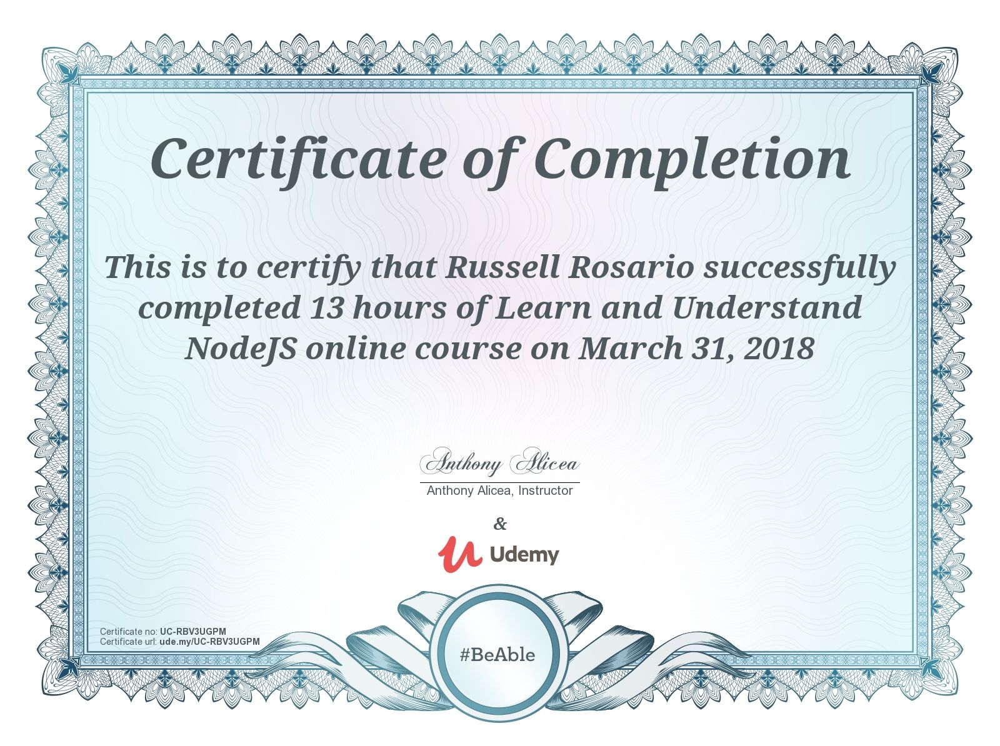
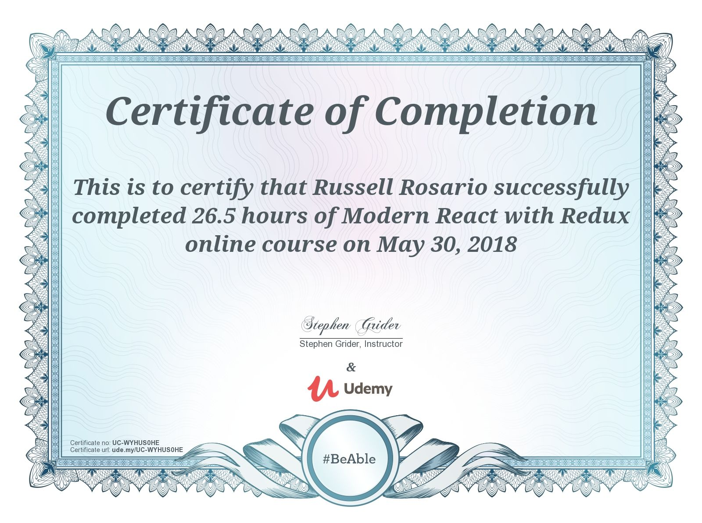
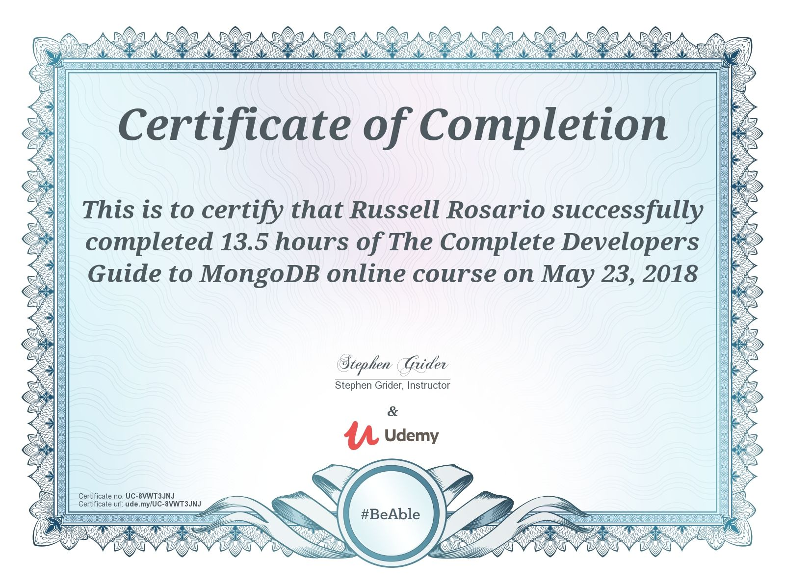
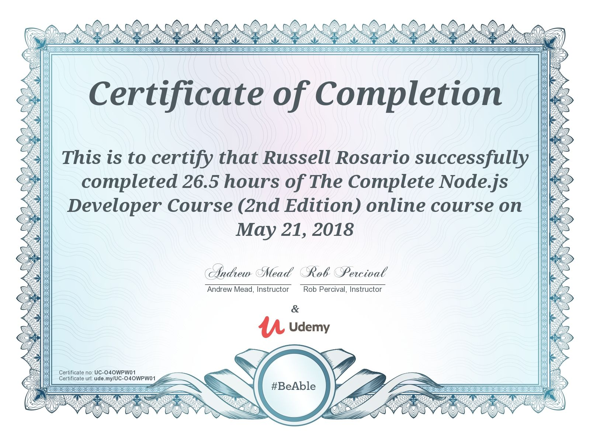
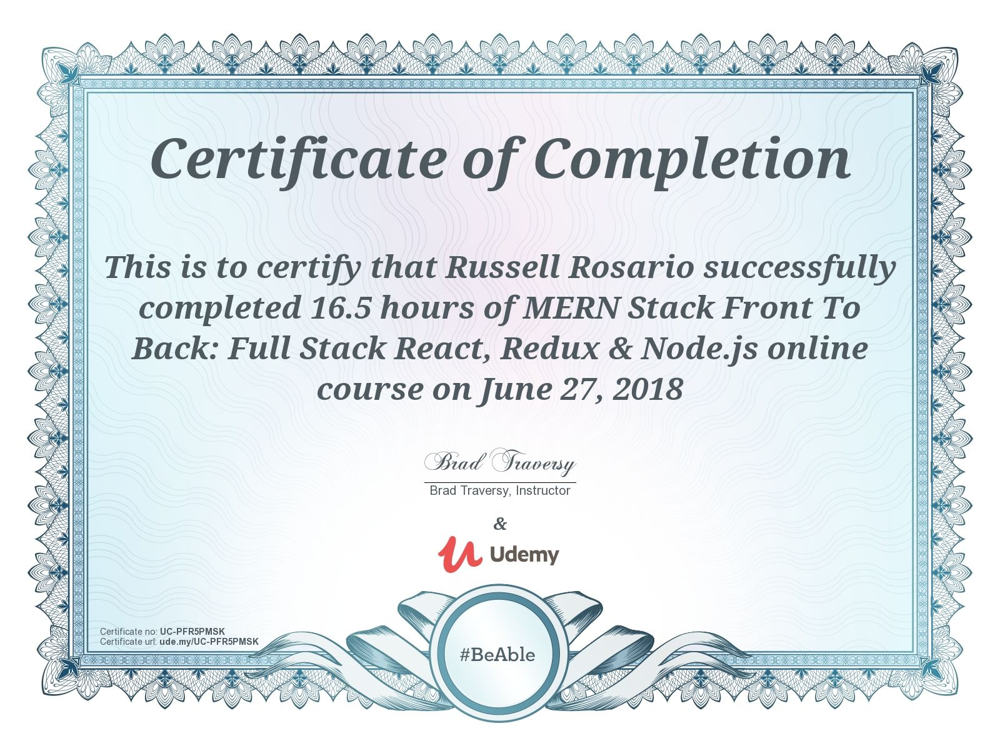
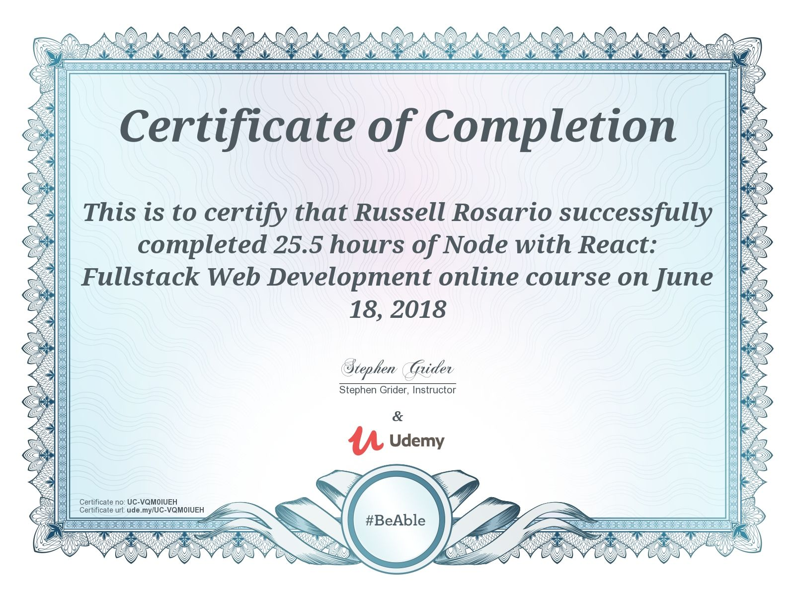
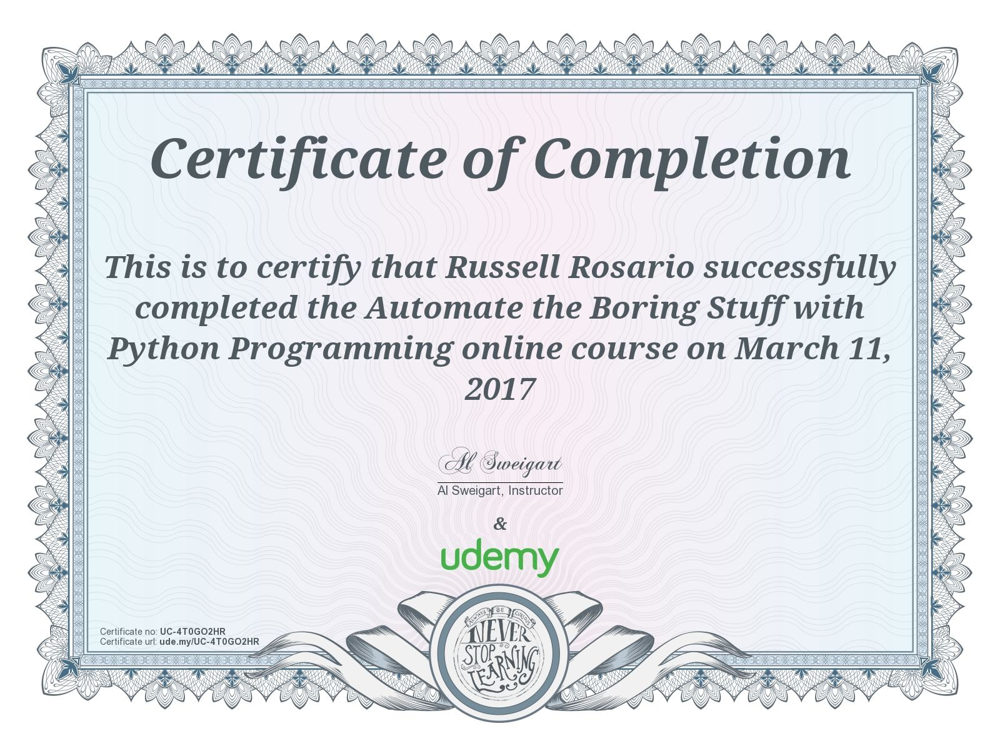
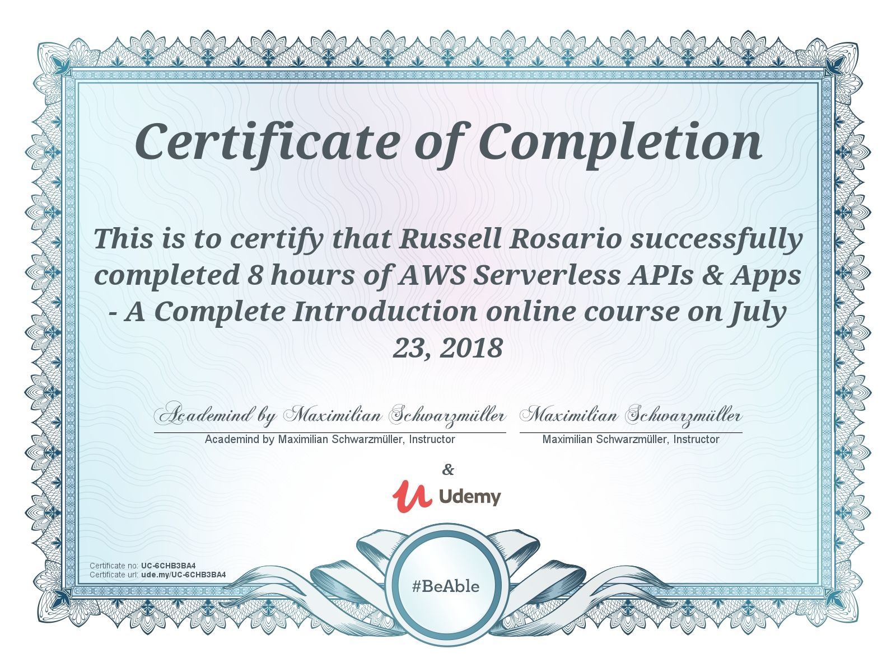

# Udemy-Certificates

### All certificates completed at Udemy

* [Javascript Understanding the weird parts](#user-content-javascript-understanding-the-weird-parts)
* [Learn and Understand Node.js](#user-content-learn-and-understand-nodejs)
* [Modern React with Redux](#user-content-modern-react-with-redux)
* [The Complete Developers Guide to MongoDB](#user-content-the-complete-developers-guide-to-mongodb)
* [The Complete Node.js Developer Course](#user-content-the-complete-nodejs-developer-course)
* [MERN Stack Front to Back](#user-content-mern-stack-front-to-back)
* [Node with React: Fullstack Web Development](#user-content-node-with-react-fullstack-web-development)
* [Automate the boring stuff with Python](#user-content-automate-the-boring-stuff-with-python)
* [AWS Serverless APIs and Apps](#user-content-aws-serverless-apis-and-apps)

## Javascript Understanding the weird parts

## Learn and Understand Nodejs

## Modern React with Redux

## The Complete Developers Guide to MongoDB

## The Complete Node.js Developer Course

## MERN Stack Front to Back

## Node with React: Fullstack Web Development

## Automate the boring stuff with Python

## AWS Serverless APIs and Apps
