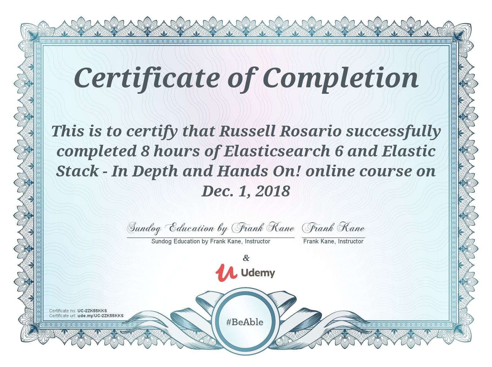

# A listing of 30+ developer certifications completed

  
 JavaScript & Node

- [Learn and Understand Node.js](#user-content-learn-and-understand-nodejs)
- [The Complete Node.js Developer Course](#user-content-the-complete-nodejs-developer-course)
- [Node JS Advanced Concepts](#user-content-node-js-advanced-concepts)
- [Javascript Understanding the weird parts](#user-content-javascript-understanding-the-weird-parts)
- [Algorithms and Data Structures](#user-content-algorithms-and-data-structures)

  
 Advanced topics 

- [Deep Learning and Machine Learning](#user-content-deep-learning-and-machine-learning)
- [Ethical Hacking](#user-content-ethical-hacking)

  
 Front-end frameworks

- [Modern React with Redux](#user-content-modern-react-with-redux)
- [Advanced React and Redux](#user-content-advanced-react-and-redux)
- [Angular Essentials](#user-content-angular-essentials)

  
 Full Stack Applications 

- [MERN Stack Front to Back](#user-content-mern-stack-front-to-back)
- [Node with React: Fullstack Web Development](#user-content-node-with-react-fullstack-web-development)
- [AWS Serverless APIs and Apps](#user-content-aws-serverless-apis-and-apps)
- [Build a Serverless App with AWS Lambda](#user-content-build-a-serverless-app-with-aws-lambda)

  
 Databases 

- [Elasticsearch](#user-content-elasticsearch)
- [The Complete Developers Guide to MongoDB](#user-content-the-complete-developers-guide-to-mongodb)
- [The Complete SQL Bootcamp](#user-content-the-complete-sql-bootcamp)

  
 Amazon Web Services 

- [AWS Certified Solutions Architect](#user-content-aws-certified-solutions-architect)
- [AWS for Devops](#user-content-aws-for-devops)
- [Amazon EC2 Master Class](#user-content-amazon-ec2-master-class)
- [Continuous Delivery on AWS](#user-content-continuous-delivery-on-aws)
- [Deploying Docker to AWS](#user-content-deploying-docker-to-aws)

  
 Python

- [Automate the boring stuff with Python](#user-content-automate-the-boring-stuff-with-python)
- [Complete Python Masterclass](#user-content-complete-python-masterclass)

  
 Accounting & Finance

- [The Startup Equity Calculator](#user-content-the-startup-equity-calculator)
- [Bitcoin for Accountants](#user-content-bitcoin-for-accountants)
- [Learn to Sell Anything](#user-content-learn-to-sell-anything)
- [Python for Financial Analysis and Algorithmic Trading](#user-content-python-for-financial-analysis-and-algorithmic-trading)

  
 Blockchain

- [Ethereum and Solidity: The Complete Developer's Guide](#user-content-ethereum-and-solidity-the-complete-developers-guide)
- [Ethereum: Decentralized Application Design and Development](#user-content-ethereum-decentralized-application-design-and-development)
- [Ethereum Developer: Build a Decentralized Blockchain](#user-content-ethereum-developer-build-a-decentralized-blockchain)

## Learn and Understand Nodejs

<a href="#top">Back to top</a>

## The Complete Node.js Developer Course

<a href="#top">Back to top</a>

## Node JS: Advanced Concepts

<a href="#top">Back to top</a>

## Javascript Understanding the weird parts

<a href="#top">Back to top</a>

## Algorithms and Data Structures

<a href="#top">Back to top</a>

## Deep Learning and Machine Learning

<a href="#top">Back to top</a>

## Ethical Hacking

<a href="#top">Back to top</a>

## Modern React with Redux

<a href="#top">Back to top</a>

## Advanced React and Redux

<a href="#top">Back to top</a>

## Angular Essentials

<a href="#top">Back to top</a>

## MERN Stack Front to Back

<a href="#top">Back to top</a>

## Node with React: Fullstack Web Development

<a href="#top">Back to top</a>

## AWS Serverless APIs and Apps

<a href="#top">Back to top</a>

## Build a Serverless App with AWS Lambda

<a href="#top">Back to top</a>

## Elasticsearch

<a href="#top">Back to top</a>

## The Complete Developers Guide to MongoDB

<a href="#top">Back to top</a>

## The Complete SQL Bootcamp

<a href="#top">Back to top</a>

## AWS Certified Solutions Architect

<a href="#top">Back to top</a>

## AWS for Devops

<a href="#top">Back to top</a>

## Amazon EC2 Master Class

<a href="#top">Back to top</a>

## Continuous Delivery on AWS

<a href="#top">Back to top</a>

## Deploying Docker to AWS

<a href="#top">Back to top</a>

## Automate the boring stuff with Python

<a href="#top">Back to top</a>

## Complete Python Masterclass

<a href="#top">Back to top</a>

## The Startup Equity Calculator

<a href="#top">Back to top</a>

## Bitcoin for Accountants

<a href="#top">Back to top</a>

## Learn to Sell Anything

<a href="#top">Back to top</a>

## Python for Financial Analysis and Algorithmic Trading

<a href="#top">Back to top</a>

## Ethereum and Solidity: The Complete Developer's Guide

<a href="#top">Back to top</a>

## Ethereum: Decentralized Application Design and Development

<a href="#top">Back to top</a>

## Ethereum Developer: Build a Decentralized Blockchain

<a href="#top">Back to top</a>
